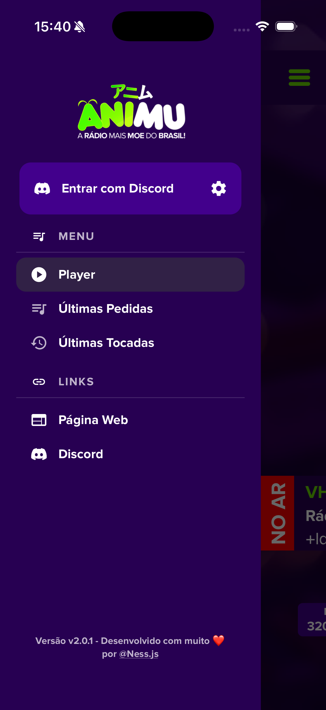

# Animu Mobile App

> The official mobile client for [Rádio Animu](https://www.animu.moe) — Brazil's most moe radio.

[](https://github.com/RadioAnimu/animu-mobile-app/releases)
[](https://reactnative.dev)
[](https://expo.dev)
[](https://www.typescriptlang.org)
[](https://play.google.com/store/apps/details?id=com.nessjs.animu)
[](LICENSE)

Founded on April 16, 2018, **Rádio Animu** is a non-profit Brazilian radio dedicated to spreading otaku culture. It plays anime songs, openings and endings, fansings, remixes, rhythm-game music, vocaloid tracks, and more — with a live DJ schedule, listener-driven requests, and community integration through Discord.

This repository is the official mobile application: a real-time internet-radio client built on React Native and Expo that mirrors the live station state — current track, cover art, live program, listener count, and request history — while keeping audio streaming and accurate now-playing metadata alive in the background.

- **Android** — available on the [Google Play Store](https://play.google.com/store/apps/details?id=com.nessjs.animu) (`com.nessjs.animu`)
- **iOS** — in development
- **Website** — [animu.moe](https://www.animu.moe) / [animu.com.br](https://www.animu.com.br)



> **📦 [`animu-api`](https://github.com/RadioAnimu/animu-api)** — the station's TypeScript API client, extracted from this app into its own repository and consumed here as a [git submodule](https://git-scm.com/docs/git-submodule) at `packages/animu-api`. It covers now playing, programs, history, music requests, live shout-outs, streams and the **Auth API v5** (multi-provider login, profiles, avatars) — see its [API reference](https://github.com/RadioAnimu/animu-api/blob/main/API.md). Not yet on npm.

---

## Features

- **Live radio streaming** with selectable bitrate — 320 kbps MP3, 192 kbps MP3, and 64 kbps AAC+. Available streams are discovered dynamically at startup from `stream.animu.moe`, with a hardcoded fallback list when the endpoint is unreachable.
- **Real-time station metadata** — the app polls the station API and keeps the UI in sync with the server-side track, cover artwork, live program, DJ, and live listener count.
- **True now-playing in the system media session** — title, artist, anime, artwork, and *real track progress* are pushed to the native notification on both platforms, including for ICY/live streams where the player's internal position is stream-time rather than track-time (see [Engineering notes](#key-engineering-decisions)).
- **Background playback** — audio continues with the screen locked via a foreground service (Android) and background audio mode (iOS).
- **Live audio visualizer (Android)** — a Home-screen oscilloscope drawn with `react-native-svg`, fed by the player's own decoded PCM (no WebView). Android taps the ExoPlayer audio pipeline (no microphone permission). Frame rate is a fixed-stop setting (0 = off, 30/48/60); the line stays hidden while paused and reveals from the centre outwards when playback starts. iOS shows *coming soon* and the entire implementation is platform-split out of the iOS bundle — iOS cannot sample a live `AVPlayer` stream (`AVAudioMix` is not applied to indefinite streams).
- **Multi-provider sign-in** — Discord (browser OAuth 2.0 + PKCE), Google (native SDK `serverAuthCode`), and **Animu Connect** username/password, all exchanging for a session on the Animu backend. Apple Sign-In is stubbed and advertised as *coming soon*.
- **Account management** — profile view with banner, linked-provider icons, custom avatar upload/reset (cache-busted), provider linking/unlinking, Animu Connect credential setup, and account deletion.
- **Music requests** — search a requestable catalog and submit a request to the station's queue, with a full form-feedback flow (success/error states) and duplicate-submission guards.
- **Live request / shout-out submissions** — validated form (name, city, artist, music, anime, message) submitted to the DJ panel.
- **Track history** — last requested and last played lists, deduplicated and merged incrementally, with a per-screen cover-art toggle.
- **Preferences** — per-view cover-art quality (`off` / `low` / `medium` / `high`), history/search cover toggles, and language selection, persisted locally.
- **Full localization** — Portuguese, English, Spanish, and Japanese, covering both UI strings and localized artwork.
- **Polished UX** — tokenized theme (`src/theme`), animated drawer, bottom sheets, toast notifications, marquee titles with tap-to-copy, and an error boundary.
- **Offline resilience** — exponential-backoff retries on API failures and graceful fallbacks for stream discovery.

## Architecture

The codebase follows a **clean, layered architecture** that keeps the UI decoupled from external systems:

| Layer | Location | Responsibility |
| --- | --- | --- |
| **Domain** | `src/core/domain` | Thin re-exports of the `animu-api` entities (`Track`, `Stream`, `Listeners`, `User`…) and pure helpers (track-progress math, filler filtering) — one import path, no app-side duplication. |
| **Auth** | `src/core/auth` | Ports & adapters around the Animu Auth API v5 plus an `AuthFacade` that owns OAuth→session exchange, persistence, and account rules. |
| **Player core** | `src/core/player` | The playback engine — small, focused units composed by a thin orchestrator (see below). |
| **Services** | `src/core/services` | Application orchestration — API facade, music/live requests, background tasks, and user settings. |
| **Data** | `packages/animu-api` | The `animu-api` submodule owns all HTTP, wire DTOs, zod schemas and DTO→domain mapping (see its [API reference](https://github.com/RadioAnimu/animu-api/blob/main/API.md)). |
| **UI** | `src/screens`, `src/components`, `src/contexts`, `src/theme` | React Native screens, reusable components, providers, and design tokens. |

The auth stack follows the same **ports & adapters** discipline: `src/core/auth/ports.ts` defines `AuthApiPort`, `OAuthPort`, and `SessionStorePort`; the adapters wrap the `animu-api` client, `expo-auth-session` + the native Google SDK, and `AsyncStorage`. Views never import the package's auth client directly — they call the `AuthFacade` through `useAuth()`.

The player core (`src/core/player`) decomposes playback into small, testable units composed by a **thin orchestrator** (`PlayerService`) that owns no playback or data logic itself — it only routes events between units and is the single writer of the React stores:

| Unit | Responsibility |
| --- | --- |
| `AudioTransport` | Native player + audio-session lifecycle (create/replace/resume/pause, status events, decoded-PCM sampling seam) |
| `AudioSampler` | Android-only visualizer gate + DSP: turns native PCM events into throttled oscilloscope frames (not a React store — hot path). Platform-split so iOS bundles a no-op |
| `TransportStateMachine` | Explicit play-intent lifecycle (`idle → connecting → playing/paused/reconnecting`) |
| `BackoffScheduler` | Reusable exponential-backoff timer (stream reconnects + data retries) |
| `NowPlayingRepository` | On-air data: parallel fetch, diffing merge, predictive track-end refresh, error backoff |
| `MediaSessionPublisher` | Pushes now-playing metadata/status/position to the OS media session |
| `HeartbeatScheduler` | 1 Hz gate + watchdog + data-poll cadence, driven natively while backgrounded |
| `ProgressTicker` | 1 Hz heartbeat — progress store updates, track-end detection, native position push |
| `ArtworkResolver` | Downloads remote covers to local files and supplies the bundled default |
| `StreamPreferences` | Persisted stream-quality choice with corrupt-storage safety |
| `NetworkMonitor` | Offline → online transitions for instant reconnect + data refresh |

The units communicate through narrow, constructor-injected dependencies (a `Timer` abstraction replaces raw `setTimeout`, fetchers and connectivity subscriptions are injectable), which makes everything but the thin native seams unit-testable with plain fakes — see `src/core/player/__tests__` and `src/core/services/__tests__` (run with `npm test`).

Snapshot state reaches React through **three external stores split by change cadence** (all built on `useSyncExternalStore` with shallow-equality diffing), so components opt into the granularity they need — a listener-count poll never re-renders the now-playing UI, and a 1 Hz progress tick never re-renders anything but progress:

| Store | Snapshot | Cadence | Consumed via |
| --- | --- | --- | --- |
| `playerStore` | current track/program/stream, stream options, `isPlaying`, `playbackState`, `isInitialized` | per song / per action | `usePlayer()` |
| `stationStore` | current listeners, request/played histories | per API poll (5s playing / 30s paused) | `useStation()` |
| `progressStore` | track progress, `showProgress` | every 1s | `useTrackProgress()` |

```
src/
├── api/                  # App-level URLs + the shared animu-api client (expo/fetch)
├── assets/               # Localized artwork, fonts and icons
├── components/           # Reusable UI (player, sheets, drawer, dialogs, avatar…)
├── constants/            # Auth/OAuth provider metadata, default user settings
├── contexts/             # Player, Auth, UserSettings, Alert, Portal providers
├── core/
│   ├── auth/             # AuthFacade + ports (API, OAuth, session store)
│   ├── domain/           # Thin re-exports of animu-api entities + helpers
│   ├── errors/           # Typed HTTP errors
│   ├── player/           # Playback engine (transport, repository, orchestrator…)
│   └── services/         # API facade, requests, background tasks, settings
├── hooks/                # Shared hooks (live-request form)
├── i18n/                 # PT / EN / ES / JP dictionaries
├── routes/               # Navigation (drawer + stack)
├── screens/              # Home (player), Requests, History, Settings, Login, Account
├── theme/                # Design tokens (colors, spacing, radii, typography)
└── @types/               # Ambient type declarations
```

## Key engineering decisions

- **Custom HTTP layer instead of a third-party client.** The `animu-api` package ships a small `fetch`-based client with `AbortController` timeouts, an in-memory GET micro-cache, structured request logging, and typed errors. Removing Axios eliminated a dependency while keeping a familiar request API.
- **`expo/fetch` for background reliability.** The shared client injects `expo/fetch`, whose dedicated native OkHttp stack keeps working while the app is backgrounded and cancels hung calls natively — React Native's default `NetworkingModule` pool can wedge in the background and freeze now-playing updates.
- **Predictive track-end refresh.** The client knows each track's `startTime` and `duration`, so it schedules a metadata refresh just before the track ends (`startTime + duration + buffer`) — keeping the UI ahead of the station instead of polling blindly.
- **Exponential backoff.** Consecutive API/network failures retry at 2 s → 4 s → 8 s → … capped at 30 s, resetting on the first success. Combined with the track-end scheduler, the app recovers from transient outages without user intervention.
- **Real track progress in the media session.** The radio plays server-side, so progress derives from the station's `startTime` + `duration` (`getTrackProgress` in `animu-api`), not from the player's internal position — which on ICY streams is stream time, not track time. The app pushes `durationSec` and periodically re-pushes the elapsed position to the media session, letting the OS interpolate the seek bar between snapshots.
- **Visibility-gated polling.** The app-level task runner (`background.service.ts`) re-arms each task only after the previous run settles, so a slow poll never overlaps itself. Polling follows visibility: 5s while playing (keeps the notification fresh on track changes, foreground or background), 30s while paused in the foreground, and fully suspended while paused in the background — nothing visible can change there, so polling would be pure battery/radio waste. Returning to the foreground always triggers an immediate refresh.
- **Native heartbeat while backgrounded.** A `playbackStatusUpdate` event beats the 1 Hz `HeartbeatScheduler` from the native player, driving progress, media-session pushes, and the data poll even when JS timers are frozen or throttled — so a live show's notification never keeps a stale title/cover.
- **Provider-agnostic auth.** `AuthFacade` composes three ports (API, OAuth, session store). Provider quirks stay in the adapters: Discord runs browser OAuth with PKCE, Google uses the native SDK and exchanges a `serverAuthCode` (no redirect URI), and Apple is stubbed behind its `comingSoon` flag. Swapping the package, mocking auth in tests, or layering caching all happen behind one boundary.
- **Auth that survives relaunch.** The OAuth/provider code is exchanged on the Animu backend for a session token, persisted to `AsyncStorage`, rehydrated on cold start, and re-checked every 60 s by a background task. A network hiccup never logs the user out; avatar changes bump an `imageVersion` to bust the image cache.
- **WebView-free audio visualizer without microphone permission (Android).** The oscilloscope reads the player's own decoded PCM through expo-audio's `audioSampleUpdate` events. `expo-audio` is patched (`patches/expo-audio+*.patch`) to replace the `android.media.audiofx.Visualizer` sampler — which the OS gates behind `RECORD_AUDIO` — with an ExoPlayer `TeeAudioProcessor` tap on the decoded playback stream, so no permission is requested. Because Expo SDK 54 ships `expo-audio` as a precompiled AAR, `package.json` opts it into source builds (`expo.autolinking.buildFromSource: ["expo-audio"]`) so the patch is actually compiled. Sampling is gated by a dedicated `AudioSampler` unit (frame rate > 0 + foreground + playing + supported) and frames are decimated to the user's chosen 0/30/48/60 fps. On iOS `AVAudioMix`/`MTAudioProcessingTap` is not applied to indefinite (live) streams, so the visualizer is Android-only for now and the whole implementation is excluded from the iOS bundle via platform-suffixed modules.

## Tech stack

| Concern | Choice |
| --- | --- |
| Runtime | React Native 0.81.5 · React 19.1 (New Architecture) |
| Build tooling | Expo SDK 54 · EAS Build · Expo dev client |
| Language | TypeScript 5.9 (strict) |
| Navigation | React Navigation 7 (drawer + native stack) |
| Audio | `expo-audio` (patched on Android for permission-free sampling) · `react-native-playback-controls` (media session) |
| Visualizer | `react-native-svg` · Android-only `AudioSampler` (ExoPlayer `TeeAudioProcessor`); platform-split (`.android`/`.ios`) so iOS ships nothing |
| Auth | `animu-api` Auth v5 · `expo-auth-session` (Discord OAuth 2.0 + PKCE) · `@react-native-google-signin` |
| State | React Context · custom external stores (`useSyncExternalStore`) |
| Storage | `@react-native-async-storage/async-storage` |
| Networking | `expo/fetch` + `AbortController` |
| API client | `animu-api` submodule (zod-validated DTOs) |
| Background | JS task runner gated by app visibility + native playback-status heartbeat |
| i18n | Custom dictionary-based localization (PT/EN/ES/JP) |
| Testing | Vitest (player core, services, domain) |

## Getting started

### Prerequisites

- Node.js 20+
- [Expo CLI](https://docs.expo.dev/more/create-expo/) and an Expo account (for EAS)
- Android Studio / Xcode toolchains for native builds
- A device or emulator. The app targets a live station backend, so most features require network access to `animu.moe`.

### Install & run

```bash
git clone --recurse-submodules https://github.com/RadioAnimu/animu-mobile-app.git
# already cloned? git submodule update --init --remote
npm install        # applies the native patches via postinstall and builds animu-api
npm run start      # Expo dev client
npm run android    # build & run on Android
npm run ios        # build & run on iOS
npm test           # vitest
npm run lint       # expo lint
```

> This project uses a development client (`expo start --dev-client`) rather than Expo Go, because it depends on native modules (`react-native-playback-controls`, `@react-native-google-signin`) and patched builds applied via `patch-package` (`patches/`): playback-controls (notification seekability/teardown) and expo-audio (permission-free Android PCM sampling for the visualizer). `expo-audio` is opted into source builds via `expo.autolinking.buildFromSource` in `package.json` — without it, Expo would link the precompiled AAR and the patch would be ignored.
>
> The `postinstall` script applies `patch-package` and builds the `animu-api` submodule if needed (`npm run build:api`).

## Build & release

Builds are managed with [EAS Build](https://docs.expo.dev/build/introduction/) (see `eas.json`):

```bash
eas build --profile development   # dev client (internal)
eas build --profile preview       # internal APK / Release simulator build
eas build --profile production    # Play Store AAB (auto-incremented version)
```

Release artifacts are submitted through `eas submit` and published to the Google Play Store (`com.nessjs.animu`).

## API surface

All station endpoints are wrapped by the [`animu-api`](https://github.com/RadioAnimu/animu-api) client submodule — full schemas and business rules in its [API reference](https://github.com/RadioAnimu/animu-api/blob/main/API.md):

| Endpoint | Purpose |
| --- | --- |
| `api.animu.moe` | Current track + artwork + listener count |
| `www.animu.moe/teste/locutor.php` | Live program / DJ information |
| `www.animu.moe/teste/ultimospedidos_json.php` | Last requested tracks |
| `www.animu.moe/teste/ultimasmusicas_json.php` | Last played tracks |
| `www.animu.moe/teste/requestSearchTest.php` | Music request search |
| `www.animu.moe/teste/sistemaPedidos/pedirquatro.php` | Music request submission |
| `stream.animu.moe/?json=1` | Available stream endpoints (`/320`, `/192`, `/64`) |
| `www.animu.moe/paineldj/…/request/salvar.php` | Live request / shout-out submission |
| `www.animu.moe/teste/login_system_project` | **Auth API v5** (`/api/v5/*`) — providers, token exchange, native login, profile, provider linking, avatar, account deletion |
| `www.animu.moe/teste/exchange-token.php` · `chatIsThisReal.php` · `byeChat.php` | Legacy Discord OAuth exchange / session validation / logout |

## Roadmap

- [ ] iOS release on the App Store
- [ ] Native Apple Sign-In once the backend can verify its identity token
- [ ] Push notifications for program/live events
- [ ] Expanded localization coverage

## License

[MIT](LICENSE) © 2023 RadioAnimu.

Rádio Animu is a non-profit community project; all artwork belongs to its respective creators and studios.
